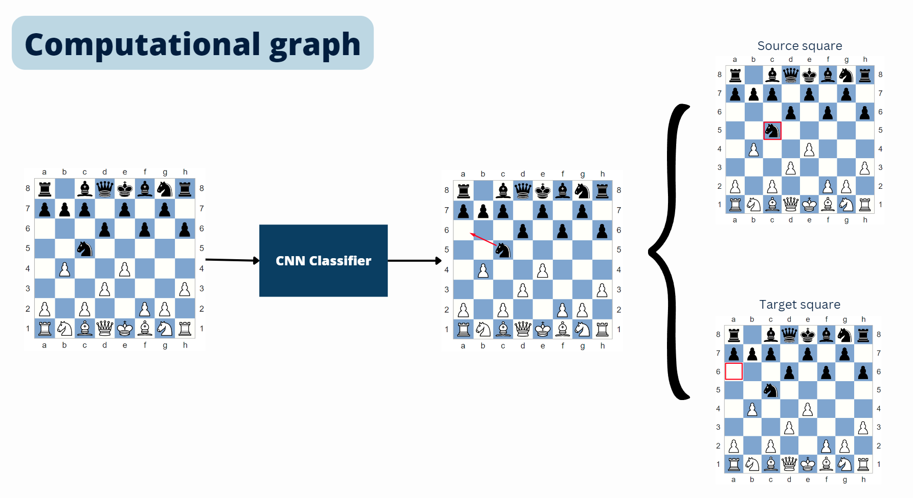
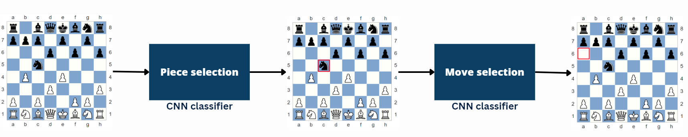

# Chess Move Recommendation System

### [Slides](https://www.canva.com/design/DAGFWP1HHR8/9TBXOGHavgasczsq5ZNkFw/edit?utm_content=DAGFWP1HHR8&utm_campaign=designshare&utm_medium=link2&utm_source=sharebutton) | [Video](https://youtu.be/KGNI8Q98qoY)

## Table of Contents

- [Introduction](#introduction)
- [Methodology](#methodology)
- [Dataset](#dataset)

## Introduction

This project is a chess move recommendation system that uses a dataset of chess games to predict the most relevant move for a given board position.

Relied on the suggestion of the most played move in the dataset, the system can be used to recommend moves for players of various levels. The system can be used as a tool to help players improve their game by suggesting the most popular moves for a given board position.

## Methodology

The model takes as input the current board position and outputs the move consisting of two parts: _which piece should be selected to move_ and _which square it should be moved to_.

We use two different approaches for the recommendation task:

1. Naive approach: we use a simple heuristic to recommend the move. The heuristic is based on the frequency of moves in the dataset. We recommend the move that has been played the most number of times in the dataset for the given board position.

2. Deep learning approach: The system consists of 7 CNN models:
   - One model for piece selection: predict with piece to move.
   - Six model for move selection: predict with target square the piece should land on. Each piece type (pawn, knight, bishop, rook, queen, king) has its own model.

## Dataset

The dataset used in this project is the [Lichess Database](https://www.kaggle.com/datasets/shkarupylomaxim/chess-games-dataset-lichess-2017-may).
